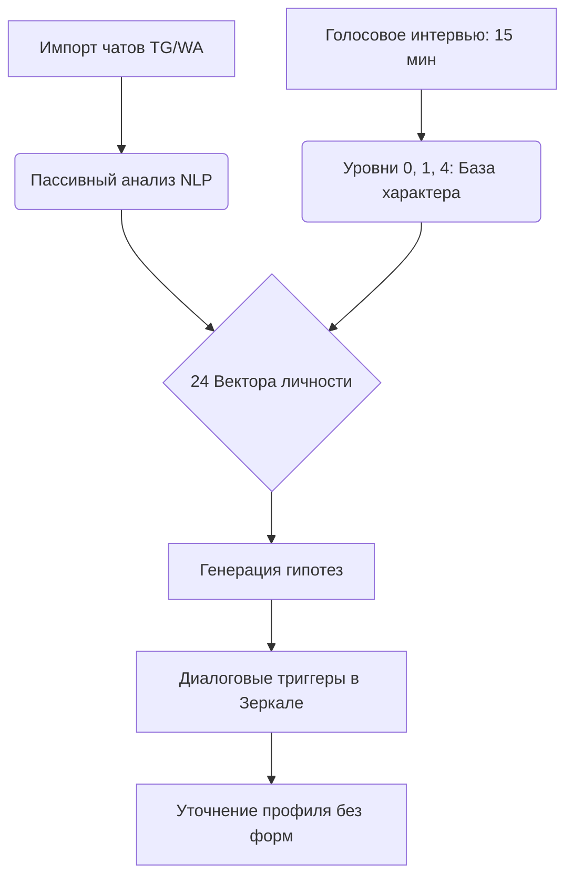

# Стратегия обучения клона по 24 векторам без заполнения длинных форм

Главная проблема традиционного клонирования — нежелание пользователя заполнять длинные опросники (100+ вопросов). Чтобы сделать обучение быстрым, эффективным и незаметным, CLOONE использует концепцию **гибридного онбординга** и **пассивного профилирования (Passive Profiling)**.

---

## 1. Стартовый этап: 15-минутное Голосовое Интервью

Когда пользователь впервые заходит в приложение, вместо текстовых форм его встречает **интерактивное голосовое интервью на 15–20 минут** (через WebRTC/аудиосообщения). Это сделано для максимального удобства, так как человеку намного проще наговорить свои мысли голосом, чем писать длинные эссе.

* **Цель интервью**: Собрать базовый психологический и биографический слепок пользователя, который закладывает первооснову его характера.
* **Темы вопросов**:
  1. *Идентификация (Уровень 0)*: Имя, ключевое определение себя, отношение к себе.
  2. *Движущие силы (Уровень 1)*: Жизненные «игры» (прошлое, настоящее, будущее), амбиции, вдохновители и слабости.
  3. *Голос и эмоции (Уровень 4)*: Захват живых интонаций, манеры построения фраз, пауз и тембра речи.
* **Обработка данных**:
  * Собранное аудио транскрибируется с сохранением оригинального синтаксиса и отправляется ML-конвейеру.
  * Эти данные мгновенно распределяются по **24 векторам личности**, предопределяя структуру характера.
  * Вычисляются первоначальные веса для `V03 (Achievements)`, `V05 (Career)`, `V13 (Comm. Style)` и `V20 (Conflict)`.
  * Формируется базовый алгоритм дальнейшего обучения клона и сценарий последующего взаимодействия с пользователем.

---

## 2. Концепция: Как клон учится быстро?

Обучение делится на два потока:
1. **Активный (Voice Onboarding & Progressive Profile)**: Голосовой экспресс-интервью-старт на 15-20 минут для инициализации ядра личности.
2. **Пассивный (Passive Profiling & RAG Auto-Enrichment)**: Клон дообучается в фоновом режиме на основе переписки (Telegram, WhatsApp), заметок (Notion) и дневника.



---

## 3. Связки и Зависимости векторов (Сокращение опросников)

Многие векторы сильно коррелируют друг с другом. Ответив на 1 вопрос, система автоматически заполняет/корректирует соседние векторы на основе статистических моделей личности.

| Базовый ответ пользователя | Вычисляемый вектор (Автозаполнение) | Взаимосвязь |
| :--- | :--- | :--- |
| **Выбранная роль: «Новатор»** | `V05: Career` (Вес 0.9)<br>`V16: Decisions` (Креативные/Рискованные) | Роль новатора отсекает консервативные паттерны принятия решений. |
| **Стиль общения: Дружелюбный** | `V13: Comm. Style` (Много эмодзи, средняя длина)<br>`V22: Attachment` (Надёжный тип) | Исключает холодный формальный стиль, автоматически сдвигает веса. |
| **Отношение к деньгам: «Инструмент»** | `V17: Financial` (Инвестиции/Риск)<br>`V03: Achievements` (Бизнес/Результат) | Автоматически снижает уровень финансовой тревоги (`V11: Fears`). |

> [!TIP]
> **Принцип домино**: Ответ всего на **10 ключевых вопросов** голосового интервью позволяет предзаполнить до **60% значений** для всех 24 векторов. Остальные 40% дообучаются пассивно.

---

## 4. Диалоговые триггеры и Генерация вопросов (Зеркало)

Вместо опросников, клон сам провоцирует пользователя на раскрытие личности через **интерактивные диалоговые триггеры** в модуле «Зеркало» или в процессе ежедневного общения.

### Типы триггеров:

1. **Триггер Противоречия (Conflict/Drift Trigger)**
   * *Когда срабатывает*: Если в импортированной переписке пользователь говорит «Я устал от бизнеса», а в профиле стоит роль «Активный предприниматель».
   * *Генерация вопроса от Зеркала*: *«Слушай, в последних чатах ты часто пишешь о выгорании, хотя мы настраивали тебя как достигатора. Мы меняем вектор на творчество?»*
   * *Влияние*: Пересчёт `V03 (Achievements)` и `V05 (Career)`.

2. **Триггер Ценностей (Worldview Trigger)**
   * *Когда срабатывает*: При обсуждении новостей или рабочих планов.
   * *Генерация вопроса*: *«Ты планируешь запуск CLOONE. Что для тебя важнее в этом проекте — заработать первый миллион или изменить то, как люди общаются с ИИ?»*
   * *Влияние*: Уточнение `V15 (Worldview)` and `V17 (Financial)`.

3. **Триггер Границ (Anti-Profile Trigger)**
   * *Когда срабатывает*: При первой попытке клона ответить на скользкую тему.
   * *Генерация вопроса*: *«Меня спросили о политике в чате. Я обычно отшучиваюсь или жёстко перевожу тему? Как бы ответил ты?»*
   * *Влияние*: Корректировка `V20 (Conflict)` и заполнение ограничений System Prompt.

---

## 5. Последовательность онбординга: Спринт к эффективности

```
[Шаг 1: Подключение API (1 мин)] 
   -> Пассивный сбор: Анализ тональности, стиля, частых слов.
   -> Вычисление: V13 (Голос), V24 (Юмор), V20 (Конфликты).

[Шаг 2: Голосовое интервью (15-20 мин)] 
   -> Интерактивный аудио-опрос по Уровням 0, 1 и 4.
   -> Первичная калибровка характера и вектора приоритетов.

[Шаг 3: Генерация первой версии личности (v1.0)]
   -> Клон готов к работе на 80% точности.

[Шаг 4: Микро-интервенции (в процессе жизни)]
   -> Зеркало раз в день присылает 1 пуш-вопрос на основе дрейфа векторов.
   -> «Living Profile» обновляется незаметно.
```

Такой подход гарантирует, что пользователь получает работающего клона **с первой минуты**, а его дообучение происходит органически, без стресса и длинных форм.
